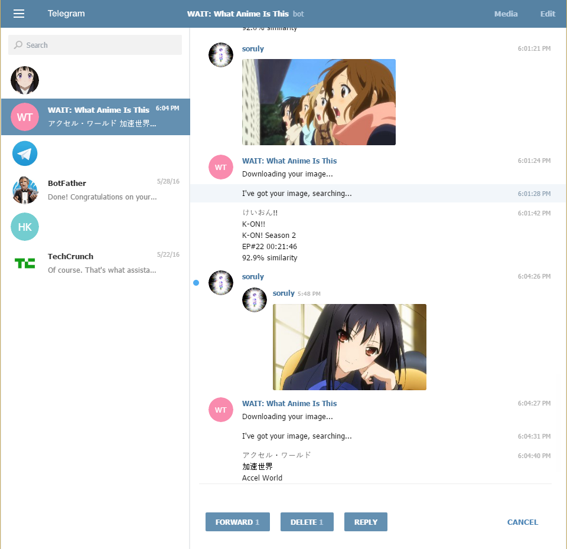

# trace.moe-telegram-bot
[](https://travis-ci.org/soruly/trace.moe-telegram-bot)
[](https://david-dm.org/soruly/trace.moe-telegram-bot)
[](https://raw.githubusercontent.com/soruly/trace.moe-telegram-bot/master/LICENSE)
[](https://discord.gg/K9jn6Kj)
[](https://www.patreon.com/soruly)

This Telegram Bot can tell the anime when you send an screenshot to it

The bot is live on telegram now https://telegram.me/WhatAnimeBot

## Features
- Show anime titles in multiple languages
- Telegram group support
- Image, GIF, Video support
- Video preview

## How to use
1. Start chatting with the bot https://telegram.me/WhatAnimeBot
2. Send anime screenshots (images, gif or video) directly to the bot
3. You may also forward images from other chats to the bot
4. The bot will tell you the anime, episode, and time code of it
5. It will also send you a video preview of that scene

## How to use (in group)
1. Add the bot `@WhatAnimeBot` to your group
2. Reply to any group image, mention the bot with `@WhatAnimeBot`
3. Wait for the bot to reply

_Note that the bot has no access to your messages before it is added to your group_

## Known issues
- Stickers are not supported
- Image URL is not supported
- Sometimes video preview is missing



## How to host the bot on your own

If you have privacy concern, you can host the bot on your own.

Please read [Telegram's official tutorial to create a Bot](https://core.telegram.org/bots) first.

You need to disable [Privacy Mode](https://core.telegram.org/bots#privacy-mode) if you want to use your bot in group chat.

### Prerequisites

- Node.js 12.x
- Redis

### Install

```
git clone https://github.com/soruly/trace.moe-telegram-bot.git
cd trace.moe-telegram-bot
npm install
```

### Configuration

- Copy `.env.example` to `.env`
- Edit `.env` as follows

```
SERVER_PORT=        # e.g. 3000
REDIS_HOST=         # Usually 127.0.0.1
TELEGRAM_TOKEN=     # e.g. 12345678:AAAAAAAAaA1AA1aa1Aaa1a_aAAaa-1aaAaa
TELEGRAM_WEBHOOK=   # e.g. https://your.host.name/12345678:AAAAAAAAaA1AA1aa1Aaa1a_aAAaa-1aaAaa
TRACE_MOE_TOKEN=    # Usually leave this empty
```

### Start server

```
node server.js
```

Optionally, you can use [pm2](https://pm2.keymetrics.io/) to run this in background.
